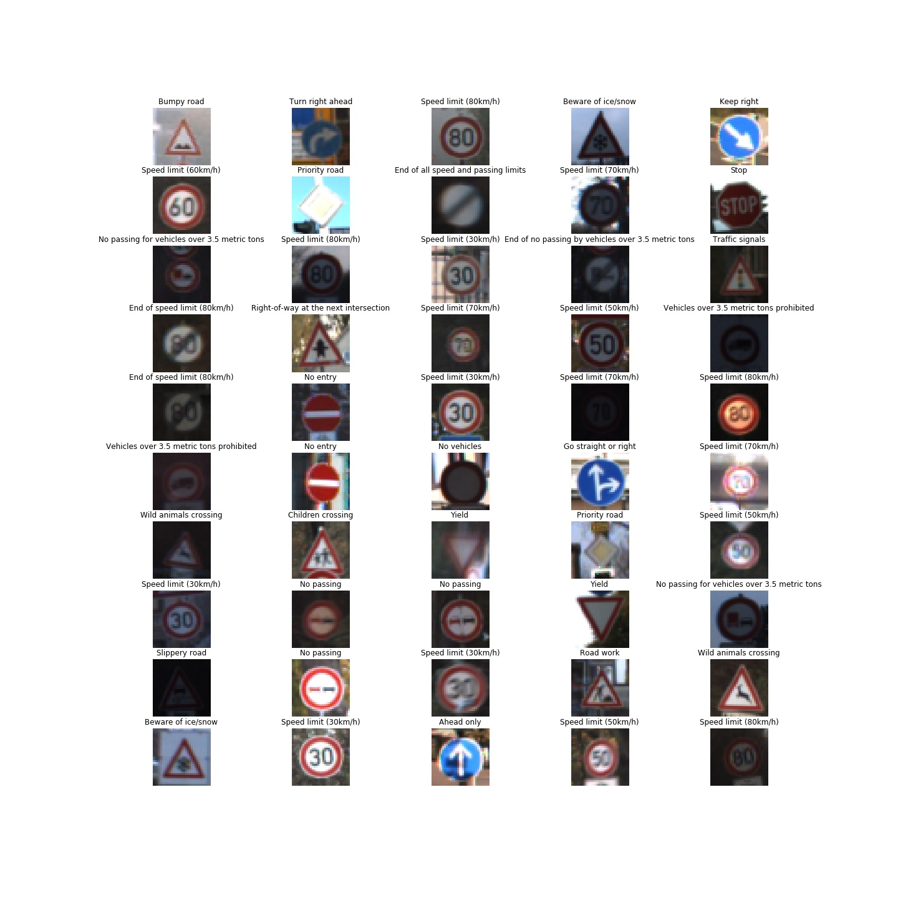
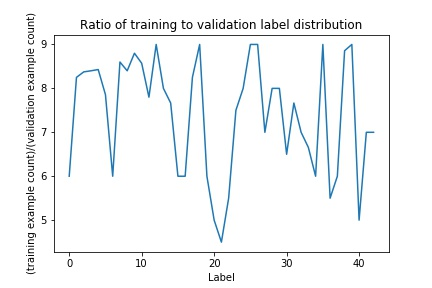

## Project: Build a Traffic Sign Recognition Program
[](http://www.udacity.com/drive)

### Overview

This project is part of Self-Driving Car Nano Degree program at Udacity. The main objective of the project
is to use deep learning to classify traffic sign images from the [German Traffic Signs Data set](http://benchmark.ini.rub.de/?section=gtsrb&subsection=dataset). 
Training, validation and test is done using the dataset availalbe for the project. Furthermore, after the best performing model has been chosen, it is used to classify
images downloaded from the Internet. The notebooks and other resources available in this repo has been forked from [the project repo](https://github.com/udacity/CarND-Traffic-Sign-Classifier-Project).

The basic structure of the project is as follows. This report summarizes the results.

* [Loading the data set](#loading-the-dataset)
* [Exploration, summary and visualization of the data set](#exploring-the-dataset)
* [Design, train and validate a model architecture](#model-architecture)
* [Use the model to make predictions on new images](#make-prediction-on-new-images)
* [Analyze the softmax probabilities of the new images](#analyze-predictions-on-new-images)
* [Remarks](#remarks)
* [Performance on Test Dataset](#performance-on-test-dataset)

*NOTE*: All the dependencies and lab environment required for reproducing the results presented in this report can be created with [CarND Term1 Starter Kit](https://github.com/udacity/CarND-Term1-Starter-Kit).

### Folder Contents

Here is an overview of what this repo contains.
```
├── Main.ipynb: the main notebook
├── Main.html: HTML export form Main.ipynb
├── data/: folder for storing data sets, models and run logs.
├── docs/: additional document resources (eg. images generated from the notebook)
├── main.py: main logic from the notebook as a python file for easy testing on the server
└── src/: contains the core python code for supporting the notebook
```

My notebook is based on the template notebook for the project 
[available here](https://github.com/udacity/CarND-Traffic-Sign-Classifier-Project/blob/master/Traffic_Sign_Classifier.ipynb).
The images and tables shown in this documentation have been generated from the notebook and just embedded or copied to this
document. 

<a name="loading-the-dataset"></a>
### Loading the Dataset

The images were provided in pickled format as part of the project. The files can be [downloaded from here](https://s3-us-west-1.amazonaws.com/udacity-selfdrivingcar/traffic-signs-data.zip).

The basic structure of the pickled files (there are three of them) is as follows. 

* `features` is a 4D array containing raw pixel data of the traffic sign images, (num examples, width, height, channels).
* `labels` is a 1D array containing the label/class id of the traffic sign. The file signnames.csv contains id -> name mappings for each id.
* `sizes` is a list containing tuples, (width, height) representing the original width and height the image.
* `coords` is a list containing tuples, (x1, y1, x2, y2) representing coordinates of a bounding box around the sign in the image. 
These coordinates assume the original image the pickled data contains resized versions(32 by 32 )of these images.


<a name="exploring-the-dataset"></a>
### Exploring the Dataset

Here's a result of exploring training and validation data sets. Test data set was not explored except for basic summary
statistic to avoid influencing model selection.


| Dataset | No. of examples | No. of classes | Image shape |
| ------- | ---------------:| --------------:| ----------- |
| Training | 34799 | 43 | (32, 32, 3) |
| Validation | 4410 | 43 | (32, 32, 3) |
| Test | 12630 | 43 | (32, 32, 3) |


The signal names can be found in [data/signnames.csv](data/signnames.csv). There is a utility method in `util.py` to 
convert a given label to sign name.

The following figure shows 25 random images from the training data set.


As seen in the distribution below, the training and validation examples are not uniformly distributed per label.
Nevertheless, the imbalance is not so stark that it has few examples for 1 or 2 classes. 


The following graphic shows the ratio of the distribution of training examples and validation examples by labels. In
general, the training set seems to be representative of the validation set. 



<a name="model-architecture"></a>
### Model Architecture

My model is based on the LeNet architecture from Yann Lecun. The basic overview of the original architecture is shown
in figure below. Main building blocks of the model are a series of convolutional layers followed by a series of fully
connected layers to return softmax probabilities on the predicted labels. The convolutional layers are followed by ReLU 
activation layers and max-pooling layers. 
 


Performance of the original architecture on the training dataset was already satisfactory. However, the performance on
the validation dataset was below par (minimum of 93% was required for the project). Tweaking learning rates or the number
of epochs did not help. This was expected and the model showed signs of over-fitting. Drop-out layers were introduced 
after each activation layer to improve performance on the validation data set.

To avoid dropping out during prediction, my model accepts an additional parameter called `keep_probability` that uses
either the value from hyper-parameter dictionary from [lenet.py](src/lenet.py) during training, or the value is set to 
`1` while predicting.

To enrich the training data set, multiple data augmentation techniques were tried out. Augmenting the training set with
horizontally flipped, randomly scaled and rotated, gaussian blurred copies of the provided examples resulted in generally
higher validation accuracy. All augmenters can be found in [augmentation.py](src/augmentation.py). For other versions of
augmenters that were tried out, refer to the git history of the file. The final set of augmenters chosen were as follows.

* 1x Gaussian Blur augmenter with kernel size of 3x3
* 5x Affine transformation augmenter with random scaling and random rotations in the range of [0.9, 1.1]
 and [-15, 15] degrees respectively as described in Sermanet et. al. (reference below). The center for rotation
 was picked with [-2, 2] pixels offset from the image center.
 
 Together, they result in the training data for this project to be 6 times the original size. 

#### Pre-processing

The images were converted to grayscale and Z-normalization was performed on the training data. The pre-processors can be
found in [preprocessing.py](src/preprocessing.py). The mean and sigma were derived from the augmented training examples
and the values were just used for pre-processing validation and test data sets.

The channel weights for the RGB channels were `[0.299, 0.587, 0.114]` as suggested 
[in this blog post](https://medium.com/@REInvestor/converting-color-images-to-grayscale-ab0120ea2c1e).

From one of the runs, the Z-normalization values were as follows. The actual value differed based on the pixel values
of after the augmentation, but the values were almost equal to the following up to one decimal place. The actual values
from each run can be found in the [run log](data/logs/run.txt).

| Mean | Sigma |
| ---- | ----- |
|  77.3 | 65.1 |

The following shows two instances of training images before and after applying pre-processing. For both
cases, the overall contrast seems to be preserved in the grayscale image and in the *Keep Right* case (the bottom image),
the contrast is slightly better. 


#### Model

The final architecture was as follows. The source code is available at `LeNet` function in [lenet.py](src/lenet.py)..

| Layer | Input | Output | Details |
| ----- | -------| ----- | ------- |
| Input | 32x32xC | - | The model supports any number of channels |
| Layer 1 Convolutional | 32x32xC| 28x28x6 | Valid padding with ReLU activation |
| Layer 1 Pooling + Dropout | 28x28x6 | 14x14x6 | Max pooling and dropout layers |
| Layer 2 Convolutional + activation | 14x14x6 | 10x10x16 | Valid padding with ReLU activation |
| Layer 2 Pooling + Dropout | 10x10x16 | 5x5x16 | Max pooling and dropout layers |
| Layer 3 Fully connected | 400 | 120 | Flattened output from previous layer as input with ReLU activation  |
| Layer 3 Dropout | | | With 70% keep probability |
| Layer 4 Fully connected | 120 | 84 | With ReLU activation |
| Layer 4 Dropout | | | With 70% keep probability |
| Layer 5 Fully connected | 84 | 43 | Outputs logits |

As for the hyper-parameters, the starting values were chosen from the hand-writing recognition project from the course.
With 70% keep probability for the dropout layers, the model was performing quite well. The starting values for the
weights in the network were chosen from a truncated normal distribution with mean (mu) 0 and standard deviation (sigma) 
0.1.

| Hyper-parameter | Value | Comments  |
| :-------------- | ------| :-------- |
| Learning rate   | 0.001 | Experimenting with 0.0009 gave slight but not so significant improvement in some cases. Learning was a bit slower though. So, 0.001 was chosen. |
| Epochs          |   50  | The validation accuracy reached a plateau already at around 30-40 epochs |
| Batch size      |  1024 | An epoch of training took around 10s, which was good enough. |
| Keep probability|   70% | Started with 80%, but lower value yielded in higher validation accuracy as expected. |
| mu              |     0 | Value inherited from MNIST dataset classification project |
| sigma           |   0.1 | Value inherited from MNIST dataset classification project |

Please refer to [runs.txt](data/logs/runs.txt) file for detail on how the accuracy was affected by various combinations
of hyper-parameters.  

Overall, the validation accuracy could reach upto **97%** with the chosen model and the hyper-parameters.

<a name="make-prediction-on-new-images"></a>
### Make prediction on new images

Five images were downloaded from the Internet by searching for "traffic signs" in Google Images Search. I randomly picked
images from signs that were in the list in [signnames.csv](data/signnames.csv). I did not really select any 
particular characteristic in the traffic signs that I chose.

The images were cropped to just show the signs, and the canvas size was changed to 32x32 as required by the model. 
[GIMP](https://www.gimp.org) tool was chosen for this task.

Here are all the images that were downloaded after they have been cropped and resized.


<a name="analyze-predictions-on-new-images"></a>
### Analyze Predictions on new Images

| Actual Traffic Sign | Predicted Sign | Probability | Match |
| ------------------- | -------------- | ----------- | ----- |
| Speed limit (50km/h) | Speed limit (30km/h) | 0.992 | :x:  |
| Speed limit (70km/h) | Speed limit (70km/h) | 0.499 | :white_check_mark: |
| Priority road | Priority road | 0.999 | :white_check_mark: |
| Right-of-way at the next intersection | Right-of-way at the next intersection | 0.999 | :white_check_mark: |
| Turn right ahead | Turn right ahead | 1.0 | :white_check_mark: | 

The following graphic shows the soft-max probabilities for the signs. The full list of predictions can be found in
 [the notebook](Main.ipynb).


Although it might appear that the accuracy for the images downloaded from the Internet is **80%**, the model really
gets confused with the numbers inside speed limit signs. It got the first sign wrong and the second sign was almost 
tipping over wrongly to 20km/h instead of 70km/h. This could have been due to mismatch in quality of the signs
in the training dataset and the test image from the Internet. Furthermore, the signs might not even have been
European signs.

I specifically looked for traffic signs showing speed limits from European roads and I found an 80km/h speed limit
from a French road. Running prediction on that sign yielded better results. To improve the overall performance of the 
model it would make sense to maybe apply contrast filters to highlight the contents of the signs even more.

The following graphic shows the soft-max probabilities on the 80km/h sign.


 
<a name="remarks"></a>
### Remarks

Due to time constraint, I skipped visualising layers using the `outputFeatureMap` function. Investigating how the network
learnt particularly the traffic signs with speed limits could shed a bit more light on why they are not
distinguished with high confidence.

<a name="performance-on-test-dataset"></a>
### Performance on the Test Dataset

Finally, I ran evaluation on the test dataset. Performance on the test data set with the aforementioned settings and 
architecture was **95.2%**.

References
==========
* LeCun, Yann. "LeNet-5, convolutional neural networks." URL: http://yann.lecun.com/exdb/lenet/
* Sermanet, Pierre, and Yann LeCun. "Traffic sign recognition with multi-scale Convolutional Networks." IJCNN. 2011. URL: http://yann.lecun.com/exdb/publis/pdf/sermanet-ijcnn-11.pdf